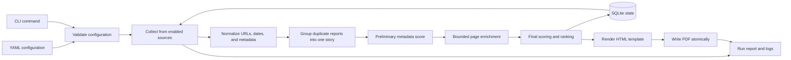

# My News: Detailed Implementation Plan

## 1. Purpose

Build a local, headless command-line application that collects recent articles from an explicit allowlist of trusted news providers, ranks them against personal interests, and generates a compact PDF digest.

The digest is an index, not a republisher. Each entry should contain:

- A linked headline.
- The provider name.
- The author, when available.
- The publication date, when available.
- A visible access warning when the story link appears restricted.
- Optionally, the interests that caused the article to rank highly.

The application should retain enough local state to avoid unnecessary downloads and, by default, avoid repeatedly recommending the same article.

## 2. Product Decisions

These are the recommended defaults. They can be changed through configuration without redesigning the application.

| Decision | Default |
| --- | --- |
| Runtime | Python 3.12 or later |
| Interface | CLI only; no server or graphical interface |
| Package layout | Installable Python package under `src/my_news` |
| Configuration | Human-editable YAML validated with Pydantic |
| Discovery order | Explicit RSS/Atom feed, feed discovery, then an explicit site adapter |
| Storage | Local SQLite database using the standard `sqlite3` module |
| Ranking | Explainable weighted keyword and phrase scoring with recency boost |
| PDF generation | Jinja2 HTML template rendered by WeasyPrint |
| Default lookback | 48 hours |
| Default digest size | 30 articles |
| Repeat suppression | Exclude articles emitted in the previous 7 days |
| Access labeling | Show likely paywalled or restricted links with a warning badge |
| Time zone | User-configured IANA zone, initially `Europe/London` |
| Network behavior | Conditional requests, bounded retries, per-host throttling, and partial success |
| Personalization | Entirely local; no LLM or external personalization API in the MVP |

## 3. Scope

### 3.1 MVP goals

1. Let the user explicitly enable or disable trusted providers and provider sections.
2. Let the user define weighted interests, phrases, required terms, and exclusions.
3. Collect articles published within a configurable time window.
4. Normalize entries and group duplicate reports into multi-outlet stories.
5. Rank entries globally according to relevance and recency.
6. Generate a readable A4 PDF with working external links.
7. Cache provider state and article history locally.
8. Continue when one provider fails, while reporting the failure clearly.
9. Support source-specific HTML adapters for providers without suitable feeds.
10. Detect and label likely paywalled or restricted article links.
11. Provide fixture-based tests that run without internet access.

### 3.2 Explicit non-goals for the MVP

- Reproducing article bodies, images, or paywalled content in the PDF.
- Crawling the open web or discovering providers that are not configured.
- Bypassing logins, paywalls, bot protection, or publisher access controls.
- Running a web service, mobile app, or graphical configuration editor.
- Training a recommendation model or sending reading history to a third party.
- Automatically scheduling runs. The CLI should be schedulable by `launchd` or cron later.
- Supporting authenticated feeds in the first vertical slice.
- Guaranteeing extraction from JavaScript-only listing pages. Browser automation should be a last-resort future adapter, not an MVP dependency.

## 4. Lessons from Similar Projects

The design should borrow patterns rather than code from these projects:

### [Miniflux](https://github.com/miniflux/v2)

- Stores `ETag` and `Last-Modified` per feed and sends conditional requests on later runs.
- Separates feed discovery, fetching, parsing, filtering, processing, and storage.
- Generates stable entry hashes and checks for existing entries before inserting.
- Treats webpage content fetching as an optional step after feed parsing.
- Records parsing failures per source and handles HTTP rate limiting and `Retry-After`.

**Adopt:** conditional HTTP caching, stable identity, staged processing, and per-source failure state.

### [RSS-Bridge](https://github.com/RSS-Bridge/rss-bridge)

- Isolates site-specific scraping in small bridge classes.
- Gives each bridge its own cache lifetime, parameters, and parsing logic.
- Prefers an official feed when one exists and limits requests and item counts.
- Includes generic CSS/XPath bridges but allows custom parsing for difficult providers.

**Adopt:** a narrow adapter interface and one independently testable adapter per non-feed source. Do not put provider selectors into generic pipeline code.

### [Trafilatura](https://github.com/adbar/trafilatura)

- Supports feeds, sitemaps, URL deduplication, polite download queues, and metadata extraction.
- Extracts title, author, date, canonical URL, description, categories, tags, and article text from structured metadata and HTML.
- Treats feeds as the best source for fresh content, sitemaps as a broader fallback, and general crawling as the most experimental option.
- Includes robots.txt-aware crawling guidance and tests extraction against saved pages.

**Adopt:** use Trafilatura for metadata enrichment rather than writing a general article extractor. Keep saved, synthetic HTML fixtures for deterministic tests.

### [WeasyPrint](https://github.com/Kozea/WeasyPrint)

- Converts semantic HTML and print CSS to paginated PDF.
- Supports external hyperlinks, PDF metadata, page counters, running headers and footers, and page-break controls.
- Exposes a direct Python API through `HTML.write_pdf()`.

**Adopt:** generate semantic HTML first, then render it to PDF. Validate hyperlinks in tests using a PDF parser rather than relying only on visual inspection.

## 5. Proposed Architecture



### 5.1 Architectural boundaries

- **CLI:** translates command-line options into application calls and exit codes. It must not contain collection or ranking rules.
- **Configuration:** loads YAML, applies defaults, validates cross-references, and returns immutable typed models.
- **Collectors:** turn a configured source into zero or more normalized article candidates plus source diagnostics.
- **HTTP client:** owns timeouts, headers, retries, rate limiting, response-size limits, and conditional request headers.
- **Normalization:** canonicalizes URLs and dates without knowing how an article was collected.
- **Storage:** stores source cache state, article identities, run history, and emission history.
- **Ranking:** is a pure, deterministic function over an article, an interest profile, and a reference time.
- **Rendering:** converts ranked articles into HTML and then PDF. It must not change ordering or scores.

## 6. Suggested Repository Layout

```text
My-News/
├── pyproject.toml
├── README.md
├── INITIAL_PLAN.md
├── DETAILED_PLAN.md
├── config/
│   └── example.yaml
├── src/
│   └── my_news/
│       ├── __init__.py
│       ├── cli.py
│       ├── config.py
│       ├── models.py
│       ├── pipeline.py
│       ├── storage.py
│       ├── http.py
│       ├── normalization.py
│       ├── grouping.py
│       ├── enrichment.py
│       ├── ranking.py
│       ├── reporting.py
│       ├── collectors/
│       │   ├── __init__.py
│       │   ├── base.py
│       │   ├── feed.py
│       │   ├── sitemap.py
│       │   └── html.py
│       └── rendering/
│           ├── __init__.py
│           ├── pdf.py
│           ├── templates/
│           │   └── digest.html.j2
│           └── static/
│               └── digest.css
├── tests/
│   ├── conftest.py
│   ├── unit/
│   ├── integration/
│   └── fixtures/
│       ├── feeds/
│       ├── pages/
│       └── configs/
└── output/
    └── .gitkeep
```

Generated databases, logs, temporary files, PDFs, and live downloaded pages should be ignored by Git. Test fixtures should be deliberately small and contain synthetic or minimal metadata rather than copied article bodies.

## 7. Configuration Contract

The application should ship an example configuration but not assume the user's actual providers or interests. A proposed schema is:

```yaml
version: 1

digest:
  title: "My News"
  timezone: "Europe/London"
  lookback_hours: 48
  max_articles: 30
  minimum_score: 1.0
  repeat_window_days: 7
  output_directory: "output"
  filename: "my-news-{date}.pdf"
  show_match_reasons: true
  show_visible_urls: false
  show_access_warnings: true
  restricted_badge_text: "PAYWALLED/RESTRICTED"

network:
  user_agent: "MyNews/0.1 (personal news digest)"
  connect_timeout_seconds: 10
  read_timeout_seconds: 20
  requests_per_host_per_second: 0.5
  max_retries: 2
  max_response_bytes: 5000000
  max_article_fetches_per_source: 20

interests:
  - id: "ai"
    label: "Artificial intelligence"
    weight: 2.0
    phrases:
      "artificial intelligence": 3.0
      "large language model": 3.0
      "machine learning": 2.0
    terms:
      "AI": 1.5
      "LLM": 1.5
      "inference": 1.0
    required_any: []
    excluded:
      - "football prediction"

  - id: "cybersecurity"
    label: "Cybersecurity"
    weight: 1.5
    phrases:
      "zero-day": 3.0
      "data breach": 2.5
    terms:
      "ransomware": 2.0
      "vulnerability": 1.5
    required_any: []
    excluded: []

sources:
  - id: "example-technology"
    name: "Example News - Technology"
    enabled: true
    kind: "feed"
    url: "https://example.com/technology/feed.xml"
    site_url: "https://example.com"
    priority_boost: 0.2
    interests:
      - "ai"
      - "cybersecurity"
    fetch_article: "auto"

  - id: "example-html-source"
    name: "Example Journal"
    enabled: false
    kind: "html"
    url: "https://example.org/latest"
    adapter: "example_journal"
    priority_boost: 0.0
    interests:
      - "ai"
    fetch_article: "never"
```

### 7.1 Validation rules

- `version` must be supported explicitly; unknown versions fail fast.
- Source and interest IDs must be unique, lowercase, and stable.
- Every source interest must reference a defined interest.
- At least one source and one interest must be enabled for `run`.
- URLs must use `https` or `http`; reject file and executable schemes.
- Weights and limits must be finite and within documented bounds.
- `lookback_hours`, `max_articles`, delays, timeouts, and response limits must be positive.
- Output filenames must not escape the configured output directory.
- Unknown keys should produce a validation error to catch misspellings.
- Secrets must not be stored directly in the normal YAML schema. Add environment-variable references only if authenticated feeds are implemented later.

## 8. Core Data Models

Use typed, timezone-aware models. Pydantic is suitable at configuration and external-data boundaries; plain frozen dataclasses are sufficient for internal immutable values.

### 8.1 `ArticleCandidate`

Required fields:

- `source_id`
- `source_name`
- `title`
- `url`
- `discovered_at`

Optional or derived fields:

- `canonical_url`
- `author`
- `published_at`
- `updated_at`
- `summary`
- `content_text`
- `categories`
- `tags`
- `language`
- `feed_entry_id`
- `content_hash`
- `collection_method`
- `access_status` (`free`, `restricted`, `unknown`)
- `access_reason`
- `access_evidence`
- `matched_interests`
- `score`
- `score_breakdown`

### 8.2 `SourceResult`

- `source_id`
- `articles`
- `request_count`
- `not_modified`
- `warnings`
- `error`
- `etag`
- `last_modified`
- `started_at`
- `finished_at`

One source failure should be represented as data rather than raised through the whole pipeline.

### 8.3 `RankedStory`

Contains the grouped story plus:

- `story_id`.
- `primary_article` (chosen representative item).
- `outlet_links` (list of outlet name, URL, and publication time).
- `outlet_links` (list of outlet name, URL, publication time, and access status).
- `outlet_count`.
- `sources` (unique source IDs and names).

- Final numeric score.
- Matched interest IDs.
- Matched phrases and terms by field.
- Recency contribution.
- Source-priority contribution.
- Exclusion decision, if relevant.

The breakdown is essential for unit tests and tuning even if the PDF only displays a short match reason.

## 9. SQLite State

Use a database in the user data directory or a configurable path, not inside the package. Add a small integer schema version and explicit migrations.

### 9.1 Tables

`source_state`

- `source_id` primary key.
- `etag`, `last_modified`.
- `last_checked_at`, `last_success_at`.
- `last_error`, `consecutive_failure_count`.
- `retry_after_at`.

`articles`

- Stable `article_id` primary key.
- `canonical_url`, normalized URL, source ID, feed entry ID, and content hash.
- Title, author, publication time, summary, categories, and tags.
- `first_seen_at`, `last_seen_at`.

`runs`

- Run ID, start and finish times, status, configuration fingerprint, output path, and aggregate counts.

`run_stories`

- Run ID, story ID, rank, score, compact JSON score breakdown, outlet count, and `emitted` flag.

`story_outlets`

- Story ID, source ID, provider name, article URL, canonical URL, author, publication time, access status, and access reason.

### 9.2 Transaction rules

- Start a run record before network work.
- Update each source state after its collection attempt.
- Save normalized candidates and grouped-story mappings before final ranking so failed rendering does not lose discovery state.
- Mark articles emitted only after the PDF has been written successfully.
- Finish the run with `success`, `partial`, or `failed`.
- Use transactions for each source update and for final run completion, not one transaction around network calls.

## 10. Collection Strategy

### 10.1 Feed collector

1. Load the source's cached `ETag` and `Last-Modified`.
2. Send `If-None-Match` and `If-Modified-Since` when available.
3. On `304`, record a successful no-change result and make no parsing attempt.
4. On `200`, enforce content-type and response-size limits, then parse RSS or Atom with `feedparser`.
5. Resolve relative entry URLs against the effective feed URL.
6. Preserve feed IDs and use feed metadata before fetching an article page.
7. Stop considering entries once they are safely older than the lookback window if the feed is in descending date order, but do not assume order unless verified.
8. Persist new cache validators only after a valid response is parsed.

Feed discovery should be a separate diagnostic command. Production runs should use the resolved feed URL stored in configuration, so a provider homepage change does not alter collection silently.

### 10.2 HTML and sitemap collectors

Only use these when a provider has no suitable feed.

- Require an explicit adapter name in configuration.
- Check robots.txt before fetching listing and article pages.
- Keep all provider selectors and parsing quirks in the adapter module.
- Bound listing pages, links, article-page fetches, bytes, and total requests.
- Restrict followed links to configured provider hosts and article URL patterns.
- Prefer structured data (`NewsArticle` JSON-LD, Open Graph, `<time>`, canonical links) over brittle visible-text selectors.
- Return a warning when expected selectors match nothing.
- Never attempt to defeat a paywall, login, consent wall, or bot challenge.
- Make an adapter failure affect only that source.

### 10.3 Collector interface

```python
class Collector(Protocol):
    def collect(
        self,
        source: SourceConfig,
        state: SourceState | None,
        now: datetime,
    ) -> SourceResult: ...
```

Inject the HTTP client and clock into concrete collectors so tests do not patch global functions.

### 10.4 Access restriction detection

Detect access status per outlet link and store one of: `free`, `restricted`, or `unknown`.

Use layered heuristics, from strongest to weakest:

1. Structured metadata: `isAccessibleForFree=false` in JSON-LD `NewsArticle`.
2. Known feed or page markers such as `premium`, `subscriber`, `metered`, or `paywall` fields/tags.
3. HTTP outcomes indicating restricted access for article pages (`401`, `402`, `403`).
4. Page content indicators in title, meta tags, or body snippets, such as `subscribe to continue`, `subscriber-only`, `sign in to read`, and `members only`.

Rules:

- Do not bypass restrictions; only classify.
- Persist the reason and the evidence used for classification.
- If signals conflict, prefer `restricted` over `free`, otherwise `unknown`.
- Classification failure must never fail the source; default to `unknown`.

## 11. HTTP and Politeness Rules

- Use one shared `httpx.Client` per run with explicit connect, read, write, and pool timeouts.
- Identify the application honestly with a stable user agent.
- Throttle requests per registrable domain; do not send concurrent requests to the same host in the MVP.
- Follow a small, bounded number of redirects and record the effective URL.
- Retry connection failures, `408`, `429`, and selected `5xx` responses with exponential backoff and jitter.
- Honor `Retry-After` and persist it for later runs.
- Do not retry ordinary `4xx` responses.
- Enforce maximum response size while streaming, before retaining the full body.
- Accept compressed responses but enforce the limit on decompressed bytes.
- Restrict URLs to HTTP(S) and block redirects to unsupported schemes.
- Cache robots.txt during a run.
- Never log credentials, cookies, full query strings containing tokens, or article bodies.

## 12. Normalization and Story Grouping

Apply these steps in order:

1. Resolve relative URLs.
2. Prefer a valid canonical URL found in feed or page metadata when it remains on an expected provider or syndication host.
3. Lowercase the hostname, remove the default port, normalize percent encoding, and remove the fragment.
4. Remove a conservative allowlist of known tracking parameters such as `utm_*`, `fbclid`, and `gclid`. Do not sort or remove arbitrary query parameters because some identify the article.
5. Normalize whitespace and HTML entities in titles and authors.
6. Parse dates into aware UTC datetimes while retaining the original source value for diagnostics.
7. Compute stable IDs in this preference order:
   - Hash of normalized canonical URL.
   - Hash of source ID plus stable feed entry ID.
   - Hash of source ID, normalized title, and publication date.
8. Group duplicates into a single story record while retaining all outlet references and URLs.

Cross-provider stories with different canonical URLs should remain separate in the MVP unless explicit grouping rules match them. Do not silently collapse distinct reporting; preserve outlet diversity in grouped output.

## 13. Enrichment Policy

Fetching every article page is unnecessary and unfriendly. Use a two-pass approach:

1. Score all candidates using feed title, summary, categories, tags, source, and date.
2. Build an enrichment queue containing:
   - Candidates missing author or publication date.
   - Candidates missing a useful summary.
   - The highest preliminary-scoring candidates up to the configured per-source limit when body matching is enabled.
3. Fetch queued pages through the same bounded HTTP client.
4. Use Trafilatura to extract canonical URL, author, date, description, categories, tags, and plain article text.
5. Re-normalize and re-run story grouping if canonical URLs changed.
6. Compute final scores.

`fetch_article` behavior:

- `never`: rely entirely on discovery metadata.
- `auto`: fetch only when fields are missing or a candidate is in the bounded enrichment queue.
- `always`: allowed for a small, explicit source, still subject to global request limits and robots.txt.

Article text may be held in memory for ranking but should not be placed in the PDF or retained by default.

## 14. Ranking Specification

The MVP ranker should be deterministic, inspectable, and useful on a small corpus. Avoid embeddings until there is evidence that lexical ranking is inadequate.

### 14.1 Text preparation

- Unicode-normalize with NFKC, case-fold, decode entities, and collapse whitespace.
- Match phrases before individual terms.
- Use word boundaries for short terms such as `AI` to avoid substring false positives.
- Do not stem by default. Users should list meaningful variants explicitly so matches remain explainable.
- Cap repeated occurrences so keyword stuffing or a long article body cannot dominate.

### 14.2 Field weights

| Field | Weight |
| --- | ---: |
| Title | 4.0 |
| Categories and tags | 2.5 |
| Summary or description | 2.0 |
| Extracted article text | 0.75 |
| Author | 0.25 |

### 14.3 Match contribution

For each configured phrase or term in each field:

$$
M = W_{interest} \times W_{term} \times W_{field} \times \left(1 + \ln(1 + \min(c - 1, 2))\right)
$$

where $c$ is the occurrence count. A term contributes nothing when $c = 0$. Each occurrence count is capped at three.

If the same text span matches both a configured phrase and its component terms, award the phrase and suppress component-term contributions for that span. This prevents `artificial intelligence` from receiving an accidental triple boost.

### 14.4 Final score

$$
S = \sum M + R + P - X
$$

- $R$ is the recency contribution: `recency_weight * max(0, 1 - age_hours / lookback_hours)`, with a default recency weight of `2.0`.
- $P$ is the configured source priority boost, constrained to a small range such as `0.0` to `1.0`.
- $X$ is an exclusion penalty. A matched excluded phrase should reject the article by default rather than merely lower its rank.

Apply these gates before accepting a result:

- The article must match at least one positive term or phrase.
- If `required_any` is non-empty, at least one of those values must match.
- The final score must meet `minimum_score`.
- The article must be inside the lookback window unless `--include-undated` is explicitly enabled.
- The article must not have been emitted inside `repeat_window_days`, unless `--include-repeats` is supplied.

Sort by final score descending, then publication time descending, then normalized title ascending. The final tie-break makes output deterministic.

Access status should not remove an article by default. A later optional setting may add a small penalty to `restricted` links, but MVP behavior is label-only.

### 14.5 Explainability

Store a breakdown similar to:

```json
{
  "total": 31.7,
  "matches": [
    {"interest": "ai", "value": "artificial intelligence", "field": "title", "contribution": 24.0},
    {"interest": "ai", "value": "inference", "field": "summary", "contribution": 4.0}
  ],
  "recency": 1.5,
  "source_priority": 0.2
}
```

Expose full details in the JSON run report and a concise `Matched: Artificial intelligence` label in the PDF when enabled.

## 15. PDF Specification

### 15.1 Content and order

- Document title and generated date/time.
- A short line stating the coverage window and number of successful sources.
- One globally ranked list, not separate provider sections, because relevance is the primary ordering requirement.
- For each ranked story: rank, linked headline, outlet count, provider list, publication date if known, and optional matched-interest labels.
- Show one primary headline link plus additional outlet links for the same grouped story.
- Display a compact indicator such as `Also reported by: 3 outlets` with clickable source links.
- Show a warning badge beside restricted links, for example `PAYWALLED/RESTRICTED`.
- If status is unknown, do not show a badge.
- A final compact diagnostics section only when sources failed, without stack traces.

Do not include article body text, images, or scraped snippets by default.

### 15.2 Print styling

- A4 pages with stable margins.
- High-contrast typography and a locally available font stack.
- Page number and digest date in the footer using `@page` margin boxes.
- `break-inside: avoid` on each article entry.
- Sensible orphan and widow rules.
- Long headlines and URLs must wrap without overflowing.
- Hyperlinked headlines must remain visibly distinguishable when viewed on screen and legible in grayscale.

### 15.3 File handling

- Render HTML in memory.
- Write the PDF to a temporary file in the destination directory.
- Validate that the temporary output is non-empty and parseable.
- Atomically replace the final path.
- Never mark articles as emitted if rendering or replacement fails.

## 16. CLI Contract

Use Typer to provide the following commands:

```text
my-news init [--config PATH]
my-news validate [--config PATH]
my-news discover-feed URL
my-news sources check [--config PATH] [--source ID]
my-news run [--config PATH] [--output PATH]
            [--since HOURS] [--max-articles N]
            [--include-repeats] [--include-undated]
            [--dry-run] [--verbose]
my-news explain RUN_ID STORY_ID
```

Expected behavior:

- `init` writes an example config only when the destination does not exist.
- `validate` performs schema and cross-reference checks without network access.
- `discover-feed` reports candidate feeds but does not modify configuration.
- `sources check` performs collection diagnostics and prints item counts and warnings without generating a digest.
- `run --dry-run` executes through ranking, prints the ordered results, writes a JSON run report, but does not produce a PDF or mark entries emitted.
- `explain` prints the stored score breakdown for tuning interests.

Suggested exit codes:

- `0`: success, including a partial run that produced a usable digest.
- `2`: invalid command or configuration.
- `3`: no source succeeded or no digest could be generated.
- `4`: PDF rendering or output failure.
- `5`: storage failure.

Partial success should be visible in console output and the run report even though the exit code is `0`.

## 17. Reporting and Observability

- Use standard Python logging with concise human-readable console output.
- Add `--verbose` for request decisions, cache hits, filtering, and score summaries.
- Give each run a UUID and include it in log records.
- Write a JSON report next to the PDF containing configuration fingerprint, timings, source outcomes, candidate counts, filtering counts, ranks, and score breakdowns.
- Include counts of `free`, `restricted`, and `unknown` outlet links in the report.
- Do not include article bodies or sensitive request headers in reports.
- End every run with a summary such as: `5 sources checked, 4 succeeded, 86 candidates, 22 ranked, 20 emitted`.

## 18. Failure Policy

- Invalid configuration: fail before opening the database or making requests.
- One source fails: continue, record the error, and generate the digest from successful sources.
- All sources fail: do not generate a normal digest; return exit code `3` and retain a failed run report.
- No articles match: generate an empty digest only when `--allow-empty` is added in a later iteration; initially return exit code `3` with a clear message.
- Feed parses but contains malformed entries: skip individual entries and retain warnings.
- Article enrichment fails: keep usable feed metadata and continue.
- Database update fails: do not claim success or mark articles emitted.
- PDF rendering fails: keep the JSON report and temporary diagnostic HTML when verbose mode is enabled, but do not replace an existing PDF.

## 19. Dependencies

Recommended runtime dependencies:

- `typer`: CLI and help output.
- `pydantic`: strict configuration and boundary validation.
- `PyYAML`: YAML parsing.
- `httpx`: HTTP client, streaming, and timeout controls.
- `feedparser`: RSS and Atom parsing.
- `trafilatura`: article metadata and text enrichment.
- `jinja2`: HTML templating with autoescaping.
- `weasyprint`: HTML/CSS-to-PDF rendering.
- `platformdirs`: user-appropriate state and cache paths.

Recommended development dependencies:

- `pytest` and `pytest-cov`.
- `respx` for mocked `httpx` requests.
- `pypdf` for PDF assertions.
- `ruff` for formatting and linting.
- `mypy` or Pyright for static type checking; choose one and enforce it consistently.

Use `uv` for environment and lockfile management if available. Confirm WeasyPrint installation on macOS during project setup because native font and rendering libraries can vary by machine.

## 20. Test Strategy

### 20.1 Unit tests

- Configuration defaults, unknown keys, duplicate IDs, bad references, and unsafe output paths.
- URL normalization, tracking-parameter removal, and story-group key generation.
- Date parsing, UTC conversion, lookback boundaries, and undated entries.
- Stable ID generation, story grouping behavior, and metadata merge precedence.
- Access-status classification precedence and conflict resolution.
- Exact phrase, word-boundary, exclusion, required-term, field-weight, recency, and tie-break behavior.
- Repeat suppression based on emission history.
- Retry decisions, `Retry-After`, response-size enforcement, and conditional headers.
- Access restriction detection from metadata, status codes, and content markers.
- Rendering context generation and HTML escaping.

### 20.2 Collector contract tests

Every collector and site adapter should pass a shared contract:

- Returns a `SourceResult` rather than leaking expected network or parsing exceptions.
- Produces absolute HTTP(S) URLs.
- Produces aware dates or `None`.
- Respects configured item and request limits.
- Handles empty and malformed input.
- Makes no real network request in the default test suite.

### 20.3 Integration tests

Create one synthetic end-to-end fixture with:

- Two feeds containing overlapping URLs and one cross-outlet same-story case.
- At least one fixture article marked restricted and one with unknown status.
- One malformed entry.
- One excluded article.
- Several articles with known relative scores.
- A source returning `304` on a second run.
- A source failure that still permits partial success.

Assert that the pipeline:

1. Creates the SQLite state.
2. Fetches and parses fixtures.
3. Groups same-story duplicates correctly while preserving all outlet links.
4. Produces the expected rank order.
5. Generates a parseable PDF.
6. Includes link annotations for every emitted article.
7. Shows the restricted warning badge for restricted links and no badge for unknown status.
8. Writes a JSON report.
9. Suppresses emitted articles on the second run.

### 20.4 Optional live smoke tests

- Mark live tests explicitly and exclude them from normal `pytest` runs.
- Test only configured feeds the user controls or has chosen.
- Assert broad health signals, not exact article titles or counts.
- Never make live provider availability a CI requirement.

## 21. Implementation Phases

Each phase should end with its listed executable check. An agent should not begin broad provider work until the fixture-only vertical slice passes.

### Phase 0: Confirm user inputs and scaffold

Tasks:

- Confirm initial provider feed URLs or provider sections.
- Confirm initial interests, exclusions, lookback, digest size, and time zone.
- Create `pyproject.toml`, package structure, configuration example, test structure, and `.gitignore`.
- Pin supported Python and direct dependency ranges, then create a lockfile.
- Add Ruff, type-check, and pytest configuration.

Acceptance check:

```bash
uv run my-news --help
uv run pytest
uv run ruff check .
```

### Phase 1: Fixture-only vertical slice

Tasks:

- Implement typed models and a minimal in-memory pipeline.
- Parse one local feed fixture.
- Rank entries using a minimal interest profile.
- Render semantic HTML and a PDF with clickable links.
- Add one end-to-end test with no database and no live network.

Acceptance check:

```bash
uv run pytest tests/integration/test_fixture_digest.py
```

The test must prove that a configured fixture becomes a correctly ordered, parseable PDF with external link annotations.

### Phase 2: Configuration and CLI

Tasks:

- Implement the complete YAML schema and cross-reference validation.
- Add `init`, `validate`, `run --dry-run`, and stable exit codes.
- Add safe path resolution and CLI overrides.
- Produce useful validation errors with field paths.

Acceptance check:

```bash
uv run pytest tests/unit/test_config.py tests/integration/test_cli.py
uv run my-news validate --config config/example.yaml
```

### Phase 3: HTTP and feed collection

Tasks:

- Implement the shared bounded HTTP client.
- Implement feed collection with redirects, conditional headers, `304`, retries, and limits.
- Implement link access-status detection and evidence capture.
- Add source result diagnostics and partial-success behavior.
- Implement `discover-feed` and `sources check`.

Acceptance check:

```bash
uv run pytest tests/unit/test_http.py tests/integration/test_feed_collector.py
```

### Phase 4: SQLite, normalization, and history

Tasks:

- Add schema versioning and initial migration.
- Persist source validators, articles, runs, run stories, and story outlets.
- Implement URL normalization, stable IDs, story grouping, and metadata merging.
- Implement repeat suppression and transaction rules.

Acceptance check:

```bash
uv run pytest tests/unit/test_normalization.py tests/integration/test_storage.py tests/integration/test_repeat_suppression.py
```

### Phase 5: Complete ranker and explainability

Tasks:

- Implement the specified field-weighted scoring formula.
- Add phrase overlap suppression, exclusions, required terms, recency, source boost, and deterministic tie-breaking.
- Store score breakdowns and implement `explain`.
- Add `minimum_score` and final result limits.

Acceptance check:

```bash
uv run pytest tests/unit/test_ranking.py tests/integration/test_explain.py
```

Use table-driven ranking tests whose expected contributions are calculated explicitly.

### Phase 6: Production PDF and reports

Tasks:

- Finish the Jinja template and print CSS.
- Add PDF metadata, page footer, diagnostics, URL wrapping, and atomic output.
- Render access warning badges in headline and outlet-link rows.
- Add the JSON run report.
- Test non-ASCII headlines, missing authors, long titles, HTML escaping, multiple pages, link annotations, and restricted badges.

Acceptance check:

```bash
uv run pytest tests/unit/test_rendering.py tests/integration/test_pdf_output.py
```

### Phase 7: Bounded enrichment

Tasks:

- Implement the preliminary scoring and enrichment queue.
- Integrate Trafilatura metadata and text extraction.
- Respect `never`, `auto`, and `always` policies.
- Re-run normalization and story grouping after canonical URL extraction.
- Ensure article bodies are neither reported nor persisted by default.

Acceptance check:

```bash
uv run pytest tests/integration/test_enrichment.py
```

### Phase 8: First real providers

Tasks:

- Add configured feed sources first.
- Add an HTML adapter only for a selected provider that has no suitable feed.
- For every HTML adapter, add saved metadata fixtures and an adapter contract test.
- Run a manual live smoke check with low limits and inspect source warnings.

Acceptance check:

```bash
uv run pytest
uv run my-news sources check --config config/local.yaml
uv run my-news run --config config/local.yaml --dry-run --verbose
```

### Phase 9: Hardening and documentation

Tasks:

- Complete README setup, configuration, tuning, troubleshooting, and macOS scheduling examples.
- Measure a representative run and document network request counts and runtime.
- Add graceful interruption handling and cleanup of temporary files.
- Run lint, type check, test suite, and a real PDF generation smoke check.

Acceptance check:

```bash
uv run ruff check .
uv run ruff format --check .
uv run mypy src tests
uv run pytest --cov=src/my_news --cov-report=term-missing
```

Replace `mypy` with the selected type checker if the project chooses Pyright.

## 22. Agent Execution Rules

An implementation agent should follow these constraints:

1. Build the fixture-only vertical path before adding multiple modules or real providers.
2. Keep provider-specific selectors and URL rules inside provider adapters.
3. Prefer feeds and publisher-provided structured metadata over broad crawling.
4. Do not introduce browser automation, an LLM, or a hosted database without a new decision record.
5. Do not persist or reproduce article body text unless the user explicitly changes the product scope.
6. Add a focused test with each behavior change and run it immediately after the edit.
7. Use injected clocks and HTTP transports so tests remain deterministic.
8. Treat malformed publisher data and source outages as expected boundary failures.
9. Preserve deterministic output: fixed time, config, fixtures, and state must produce the same ordering.
10. Keep migrations forward-only and back up the small SQLite file before a destructive future migration.
11. Document any provider terms, robots.txt restriction, or access limitation found while adding an adapter.
12. Stop implementing an adapter if it would require bypassing access controls; report the limitation and use another source method.

## 23. Definition of Done

The MVP is complete when all of the following are true:

- A user can define at least two enabled providers and two weighted interests in YAML.
- `my-news validate` catches invalid source and interest configuration without making network requests.
- `my-news run` collects recent feed entries, tolerates one failed provider, and reports source outcomes.
- Duplicate URLs and tracking variants are grouped into one ranked story with multiple outlet links.
- Ranking is deterministic and every score can be explained by stored contributions.
- A generated PDF contains no article bodies, orders stories by relevance, and has working links for all outlets in each grouped story.
- Restricted links are labeled with `PAYWALLED/RESTRICTED` (or configured equivalent), with `unknown` links left unlabeled.
- A second run uses conditional feed requests and suppresses recently emitted articles by default.
- The default test suite is fully offline and covers the fixture-only end-to-end path.
- Linting, type checking, and tests pass.
- README instructions take a new macOS checkout from environment setup to a generated digest.

## 24. Deferred Enhancements

Consider these only after observing the MVP in regular use:

- Positive and negative feedback commands to adjust per-interest weights.
- BM25 ranking over the local article corpus if simple lexical scoring is insufficient.
- Local embeddings for semantic matching, with a lexical fallback and explainability retained.
- Stronger near-duplicate semantic clustering with source diversity controls.
- Per-provider quotas so one prolific provider cannot fill the entire digest.
- Topic sections after global ranking.
- OPML import for feed sources.
- Authenticated feeds through environment-backed secrets.
- `launchd` setup and retention cleanup commands.
- An HTML digest or email output alongside PDF.
- A local read-later export.

## 25. Inputs Needed Before Real-Provider Work

These choices do not block the fixture-based implementation, but they are required before Phase 8:

1. The initial trusted providers and, where relevant, their sections or feed URLs.
2. The first interest profile, including important phrases and obvious exclusions.
3. Desired lookback period and maximum number of articles.
4. Whether previously emitted articles should be suppressed for 7 days or another period.
5. Whether concise match reasons should appear in the PDF.
6. Whether the digest is mainly read on screen or printed, which determines whether full URLs should be visible.
7. Whether restricted links should only be labeled or also be slightly de-prioritized later.